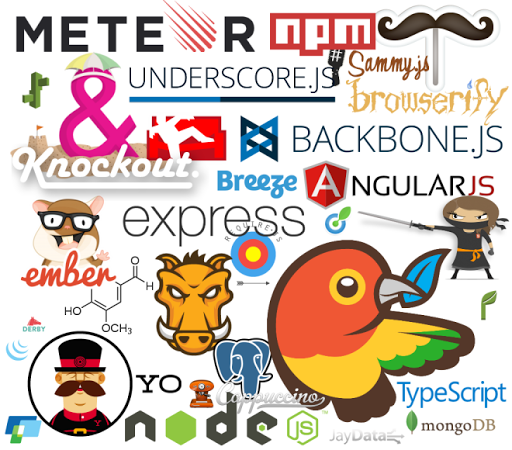
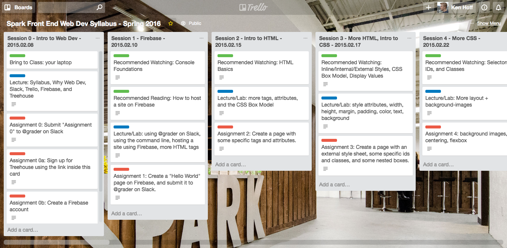

I recently taught a Front End Web Development class at [Spark Boulder](http://sparkboulder.com/)! The class was 10 weeks long, 2 sessions a week (1.5 hours each) and covered basic HTML, CSS, and JavaScript. There were 6 students, and I had an absolute blast teaching it.

Usually when doing game jams (48 hour game development competitions), it's handy to do a "postmortem" after every jam, to help us understand what went well and what we can do better next time. I thought it'd be helpful to do a similar postmortem for the class.

# Things that went well

## @classbot 🤖

@classbot is a [Slack bot](https://api.slack.com/bot-users) that graded submitted student assignments for the class!

To submit an assignment, the students would build a site with HTML, CSS, and JavaScript, and deploy it to the internet (usually using [Firebase Hosting](http://firebase.google.com/)). Then, they'd hop on the class Slack, open up a direct message with @classbot, and type in:

```
submit 8 http://my-awesome-site.firebaseapp.com
```

Then, @classbot would have a look at their site, grade it, and give the student a percentage grade, as well as a description of all test cases that passed and didn't pass. **Mathematical!**

Students can submit any assignment as often as they want, whenever they want, and we'll only ever take the most recent grade. This is _great_ for students - they can submit an empty, 0% assignment, then iterate on it bit by bit until they reach an acceptable grade. In addition, there's no problem if they want to submit assignments late, or early!

@classbot is hosted on [Heroku](https://www.heroku.com/) and the source code is [available on GitHub](https://github.com/kenhoff/classbot).

## "More dumb fun web dev stuff"

I'd usually show off a "More dumb fun web dev stuff" link near the beginning of each class session. Sometimes I'd include a short blurb about why I found it interesting.

Here's a sampling of the links that I included so far:

- [Jennifer Dewalt](http://jenniferdewalt.com/)
- [Polygons](http://ncase.me/polygons/)
- [Placecage](http://www.placecage.com/)
- [Firewatch](http://www.firewatchgame.com/)
- [Millenials to Snake People](https://chrome.google.com/webstore/detail/millennials-to-snake-peop/jhkibealmjkbkafogihpeidfcgnigmlf)
- [Code in the Dark](http://codeinthedark.com/)
- [TSA Randomizer](https://kev.inburke.com/kevin/tsa-randomizer-app-cost-336000/)
- [xkcd: Garden](http://xkcd.com/1663)

## "How to be a Web Developer"

At the end of each class session, I'd include this slide:

> How to be a Web Developer:

> 1. Look stuff up on the internet
> 2. Make stuff
> 3. Repeat

> (at some point, someone will call you a professional)

So, turns out that if you've never programmed before in your life, learning all of this stuff in 10 weeks can be pretty intimidating. It sometimes feels like there's too much to learn, all the friggin time - but that feeling never really goes away.

I try to remind students of that. It's normal to feel totally overwhelmed at the amount of stuff that you want/need to learn in order to be successful at web development.

When the inspirational messages didn't work, I'd remind students that learning web development feels like trying to draw an owl:


## Treehouse 🌴

For the class "textbook", I had the students sign up for a [Treehouse](https://teamtreehouse.com/) membership. It's $25/mo, which is $75 for the duration of the class, but still a helluva lot cheaper than a lot of textbooks out there.

Treehouse is _awesome_. A wonderful mix of lectures, presentations, projects, assignments, and it has videos on every single topic we cover in this class. Also, their production quality is _phenomenal_.

If you want to learn all sorts of web dev, I totally recommend that you sign up. You can use [my referral link](http://referrals.trhou.se/kenhoff2) - let me know if you do, and I'll buy you a beer!

## Spark Boulder 💥


[Spark Boulder](http://sparkboulder.com/) is an entrepreneurial student coworking space on the Hill. I'm not a student anymore, but Fletch ([Fletcher Richman](https://www.linkedin.com/in/fletchrichman), who started Spark Boulder) and I did take a few startup-y classes together back in college. Once I moved back to Boulder, I rented a desk in Spark, and Fletch let me know that they were looking for a web dev instructor.

Spark is quiet, cool, and has a great space for teaching these kinds of classes. I'd usually turn on the low-level christmas lights, set up all the tables in a circle in front of the projector, throw on some [Infinifactory](http://www.magicalwasteland.com/infinifactory-ost/), and have a quiet, productive, engaging class.

## Drinks after class on Wednesdays 🍻

About halfway through the class, I started getting drinks with students after our session on Wednesdays. We'd usually head over to Illegal Pete's on the Hill, and talk about web dev, jobs, technology, discipline, learning, all sorts of things. Sometimes I'd invite a professional web dev or entrepreneurial friend so that the students could pick their brain.

It was a lot of fun! It's a great way to spend time with the students outside of the student-teacher relationship, and to make some new friends. Plus, students get to hear war stories that I don't usually get to tell during class.

# Things that could have went better

## Google Slides

I generally really like Google Slides. Super easy to use, lightweight, and quick to get together pitch/info decks.

For code-heavy presentations? Not really all that great. I found myself having to format a bunch of text manually to distinguish between emphasis, code, and side notes. I tried to stick to a prebuilt theme for all 20 sessions, but any time I wanted to use different styles or formatting, I knew that I should really go back and change **all** the slides to match the new styles and formatting.

Wait...I'm a web developer. There's gotta be a solution to needing to apply the same style to multiple documents at once...what was it called? CSS?

And that's why the slides are now all written in HTML! (well, technically, they're written in Markdown, and it gets converted to HTML)

[Check out the (new) first session slides here.](https://hoff.tech/classes/frontendwebdev/sessions/0) Whenever I update the styles or formatting on any of the future slides, it automatically applies to all of the previous slides too. **Algebraic!**

## @classbot is **insecure** 🔓

Ruh roh! Turns out that @classbot is insecure 😱 (he's fine with how tall he is though, har har)

What do I mean by "insecure"? Too bad, I'm not going to tell you and make it easy. I know of two **major** vulnerabilities that would let blackhats completely wreck it.

I make backups of all the data regularly, but that's not an excuse. Gotta get that stuff fixed right away.

## Client project delays

During the class, I asked students to find a client that needs a website built. Something simple, like a landing page, or a long scrolling single page, or a small group of pages for a business.

This usually goes really well, because most of the students take this class in order to be able to build a site for someone that they already know. They're already in contact with that person, and they already have a good idea of what they're looking for, so it's easy for them to get started right away. However, if students are starting from scratch looking for someone, it can get a little...difficult.

One of my students got a lot of interest from a local restaurant, but when he tried to meet with the restaurant owner, they had scheduling issues the first time...and the second time...and the third time. Eventually, he just had to scramble to find someone else by the end of the class ☹️

## The cognitive leap between markup and programming

There's this sort of "split" that happens with Front End Web Dev.

For the first half of the class, students are generally feeling pretty good. They understand HTML, and they've got a good handle on CSS. They've used some JavaScript-y Bootstrap components, and might have even played around with `flexbox`.

Then you get into some real JavaScript stuff. Handling user interactions events on the page, retrieving, manipulating, and sending data. Variables, conditionals, loops, functions, callbacks, data types, asynchronous and synchronous functions and events.

Students who have never programmed before feel lost all over again when we get to the second half of the class. There's a pretty big cognitive leap that needs to happen between HTML/CSS (which is just _markup_) and JavaScript (which is literally _programming_).

## How much web development can you learn in 30 hours?

Let's say that you've never coded before in your life, and you'd like to get an internship at a company doing Front End Web Dev. What do you need to learn?



HTML and enough CSS to get by, that's a given. Well, wait. What about media queries? Responsiveness in general? Flexbox? What if the company you work for doesn't like using CSS/JS component frameworks? You might need to know how to implement a navbar/dropdown/form validation toolkit from scratch.

Hoo boy, we haven't even gotten to JS yet. Assuming that your company already has some _sane_ API structure in place (read: not SOAP or OData or whatever else Microsoft has been shoving down companies' throats for the past 20 years) then you've got to know how to make an AJAX request using jQuery (but wait! maybe your company doesn't want to use jQuery, so you've got to know how to manually construct and respond to an `XMLHttpRequest`, or use `window.fetch`, and polyfill that), which means you've got to understand JavaScript object structure.

Then, let's get into using functions as object values (otherwise known as class methods), and it's probably good to understand prototypical inheritance while you're at it, because you're guaranteed to be asked object-oriented questions in your interview by some bitter backend enterprise Java developer, but then you should really understand the basics of lexical scoping, and then you get confused by the difference by `var` and `let` and a fat arrow and now you're just like what the hell is ES6 I want to go home and not do this anymore.

And then someone asks you if you prefer Angular or React and you have to say, um, I don't know, I think one's a library and the other's a framework but I can't remember which is which? And Babel and transpilers and build pipelines have something to do with it and you can't quite tell if you actually know any of this stuff or if you're just saying a bunch of buzzwords and oh god please don't make me set up Webpack.

30 hours of lectures and assignments later, you now know how much you do not know.

## Using Trello for the syllabus



I ended up using Trello for the syllabus. Trello is really nice for structuring pipelines of data - implementation backlogs, simple CRMs, event planning, all sorts of things. I put the whole syllabus, readings, links to lecture slides, and the assignments all on a Trello board for the class. [You can check out the Spring 2016 version here.](https://trello.com/b/LBDOP0nh/spark-front-end-web-dev-syllabus-spring-2016)

This worked pretty well, until I started having to modify assignments. Because @classbot had its own version of the assignment requirements, I ended up having to copy-paste assignments back and forth between @classbot and the Trello card that it was associated with. Sometimes I'd forget to update the Trello card with new stuff from @classbot or vice versa - it ended up creating a lot of confusion for the students and extra work for me.

My solution? Move the whole syllabus, readings, lecture slides, and assignment info onto @classbot. Now, @classbot knows about everything - there's only _one place_ for students to get syllabus info, readings, lecture slides, and submit assignments. **Rhombus!**

# Conclusion

Not everything was rainbows and sunshine and unicorns, but the students absolutely loved it and left some glowing reviews for me. I'm excited to be teaching the class again this summer! I'll post another postmortem shortly after the class ends, talking about the changes I made and what I'd like to do next.

Excelsior! 🚀
