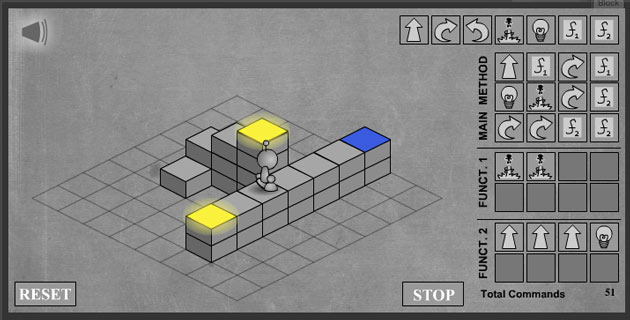

## Improving Educational Game Design Methods: A Rubric to Assess the Engagement and Educational Value of Educational Games

At the University of Colorado at Boulder, Computer Science students have two capstone options. They can either do a [Senior Project](http://www.colorado.edu/cs/tracks/senior-project), where they work in groups on a contracted project for a local company, or they can do a [Senior Thesis](http://www.colorado.edu/cs/tracks/senior-thesis), an undergraduate research paper similar to a dissertation. I began my thesis Spring 2013 and finished Fall 2013.

Originally, my thesis was going to be on [emergent gameplay](http://en.wikipedia.org/wiki/Emergent_gameplay); the idea that within games, complex phenomena arise from interactions between simple objects. My favorite examples of this are in [Dwarf Fortress](http://www.bay12games.com/dwarves/), [Banjo Kazooie: Nuts and Bolts](http://en.wikipedia.org/wiki/Banjo-Kazooie:_Nuts_%26_Bolts), and [Left 4 Dead 2](http://www.valvesoftware.com/publications/2009/GDC2009_ReplayableCooperativeGameDesign_Left4Dead.pdf).

After discussion with the committee, my research topic was changed to Educational Game Design. I analyzed a number of educational game design patterns, and found several games that had implemented those methods. Then, I used [Amazon's Mechanical Turk](https://www.mturk.com/mturk/welcome) to have 300 people rate the games on how well the game used the design method. I also used Mechanical Turk to quiz 120 people on how much they had learned after playing an educational game.

There was no statistically significant evidence that educational games improve a player's understanding of a subject. However, using Mechanical Turk to collect all the information was novel; future research can just increase the number of samples collected to get more definitive results.
