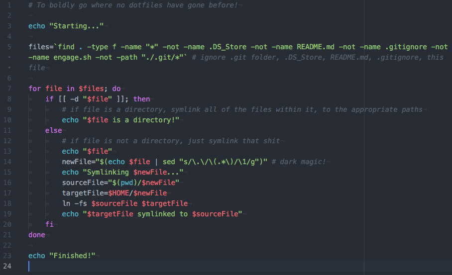

Do you have dotfiles?

I heard about dotfiles from my favorite developer person in the world, [Zach Holman](https://zachholman.com/2010/08/dotfiles-are-meant-to-be-forked/).

Dotfiles are those hidden files in your user directory that start with dots, like `.bashrc` or `.atom` or `.ssh`. They're individual to every developer - we all have our own command line aliases, our own editor config files, our own git configuration.

If possible, I'd recommend writing a script from scratch that symlinks all of your dotfiles from a GitHub repo directory to your home directory. It really helps you understand your dev environment configuration, and whenever you change a config or set up a new machine, you can just pull all the changes and run the script again. (It's also a great exercise in how much bash you know!) [Check out my script as a starting point!](https://github.com/kenhoff/dotfiles/blob/master/engage.sh)

[You can check out all of my dotfiles on GitHub.](https://github.com/kenhoff/dotfiles)
