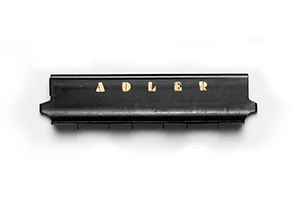
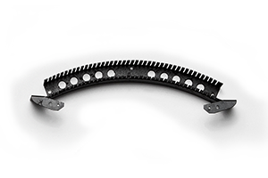

[hoff.tech](https://hoff.tech/) is built using [Metalsmith](http://www.metalsmith.io/).

Metalsmith is a file processing pipeline tool. It's a little like a static site generator, like [Jekyll](https://jekyllrb.com/) or [Octopress](http://octopress.org/), but generating static sites is just one of the many things that it's capable of.

hoff.tech is a static site, which means that it consists only of HTML, CSS, and a wee bit of client-side JavaScript. There's no server-side processing here! Every time a browser requests the page at hoff.tech, the server grabs the file `index.html` and sends it back out over the wire. No modification, footer date stamps, or hit counters added!

However, there's a **ton** of processing that goes into building the site before deploying the static version to the server. Every time the site changes locally while developing (or, while deploying the site to production), the changed files and assets need to be run through a big long Metalsmith processing pipeline to produce a new version of the site.

The Metalsmith file processing pipeline can do a ton of different things, but can basically be reduced to three steps:

1.  Grab all the files from the `src` directory
2.  Do stuff to them
3.  Write the changed files to the `build` directory

Step 2 is the fun part. For [`metalsmith-markdown`](https://github.com/segmentio/metalsmith-markdown), it'll grab all Markdown files (files with the `*.md` extension) in your `src` directory, convert them into HTML files, and write them to the `build` directory.

Things get a bit more complicated when you start chaining plugins together. If you wanted to generate your HTML files with [heading permalinks](https://remysharp.com/2014/08/08/automatic-permalinks-for-blog-posts), you'd run it through `metalsmith-markdown`, then take all of those generated HTML files and add anchor tags to each heading, and then write the results to `build`.

Things get more complicated when you want to use [branches](https://github.com/ericgj/metalsmith-branch), or process [~~jade~~ pug templates](https://github.com/ahmadnassri/metalsmith-pug) and [layouts](https://github.com/superwolff/metalsmith-layouts), or [preprocess some CSS](https://github.com/esundahl/metalsmith-stylus).

hoff.tech is hosted on [GitHub Pages](https://pages.github.com/), on my user repo [kenhoff.github.io](https://github.com/kenhoff/kenhoff.github.io). Fo' free!

hoff.tech is continuously integrated and built on [CircleCI](http://circleci.com/) using [scary dark magic](https://github.com/kenhoff/kenhoff.github.io/blob/source/deploy.sh). Spoooooky!

I actually ended up building my own Metalsmith plugin just for hoff.tech! I needed to automatically resize all of the mega images that I got from [Unsplash](https://unsplash.com/) to decrease my page's load time, so I built [metalsmith-image-resizer](https://github.com/kenhoff/metalsmith-image-resizer).

## Why Metalsmith?

Because I'm a Node person, and I don't really want to be a Ruby person. Sorry :(

<blockquote class="twitter-tweet" data-lang="en">
Static sites are the fixies of the Internet.
&mdash; Paul Graham (@paulg) <a href="https://twitter.com/paulg/status/402205795552489472">November 17, 2013</a></blockquote>

Disclaimer: I ride a shiny black-and-gold fixie to work every day.

