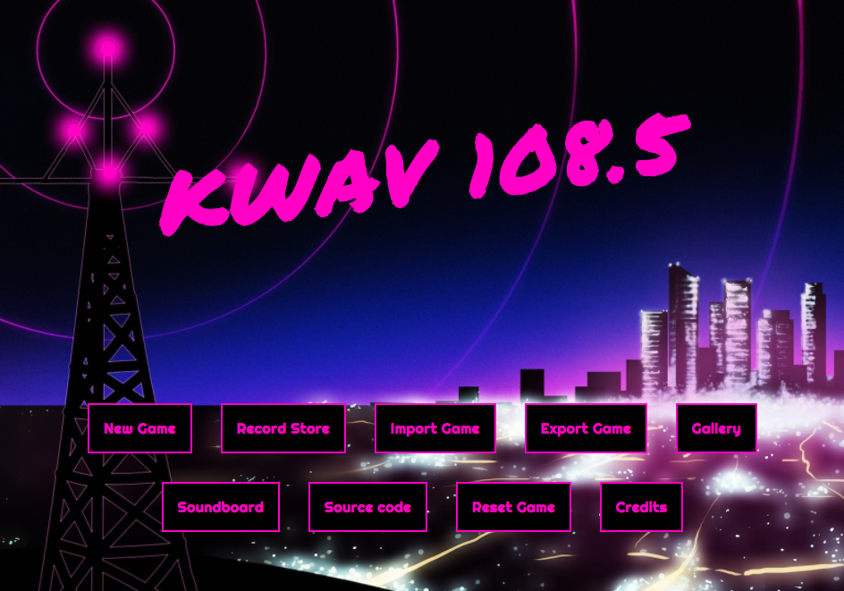
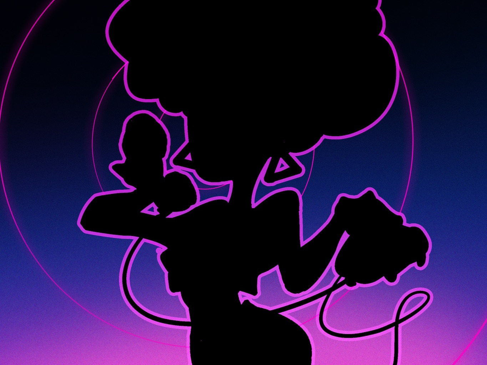
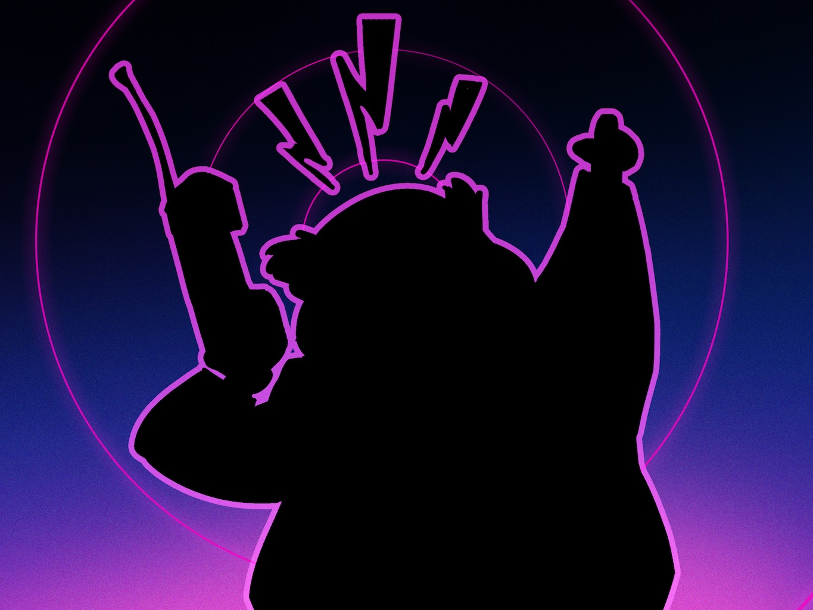
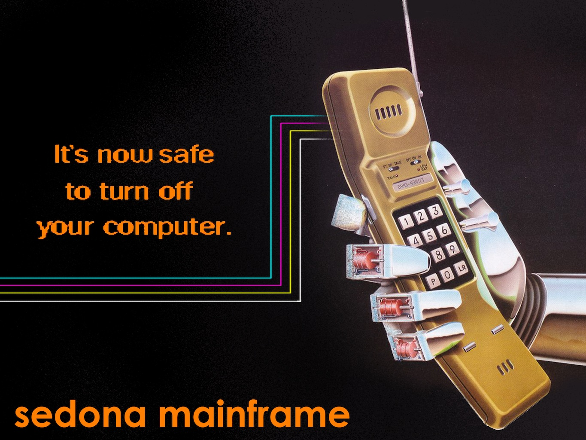
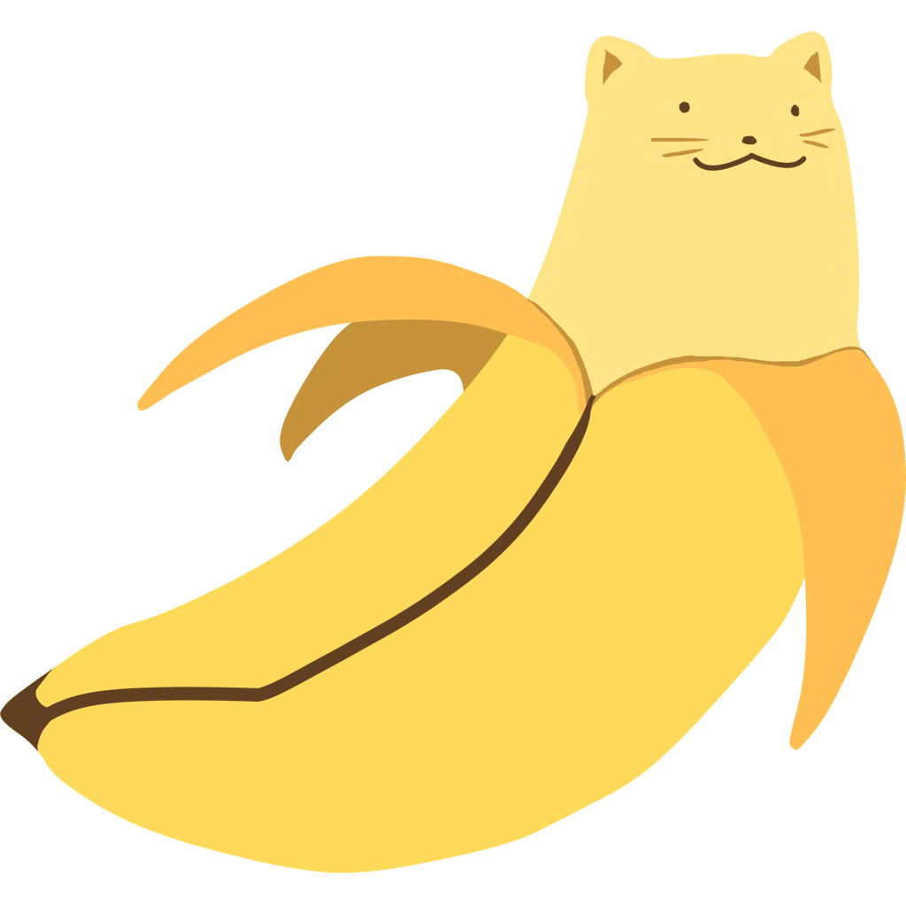

[Play KWAV 108.5 here!](https://hoff.tech/kwav-1085/)

Hey, it happened again!

For those of you just joining us, [Global Game Jam](http://globalgamejam.com/) is a 48-hour game development competition/celebration. It's distinct from [Ludum Dare](http://ludumdare.com/compo/) in two major ways - you generally go to a physical jam site to participate (there's hundreds of them all around the world) and you're encouraged to work with teams for the whole event.

Once again, I'm stupid lucky to get to work with the two amazing creatives from Bananacat Studios, [Kasey Corlett](http://kaseykingdom.tumblr.com/) and [Joshua Du Chene](http://joshuaduchene.audio/). Kasey's based in Denver, and Josh joined us remotely from Seattle!

I came into the jam with a bit of a half-baked collectible-card-game/deckbuilding/roguelike idea. The idea was that you would be delving into a dungeon, encountering monsters, traps, and puzzles - complete with shitty, Tolkien-esque fantasy premise.

For each encounter, you would have to play a card from your hand (use an "ability") to try to resolve or handle the encounter. If you succeeded, you'd get farther in the dungeon, and potentially get more treasure. If you failed, you died, and had to start over - but you'd keep all your loot, so you could sell it back at the town for better abilities and equipment.

The idea was _just_ generic enough that we could drag-and-drop any kind of aesthetic and "mechanics" into it. I could make it the shitty Tolkien-esque fantasy dungeon crawler, or some kind of futuristic hacking game, or some kind of nightmarish high-school-social-scene-navigator, or even a [political dating sim](https://www.kickstarter.com/projects/1313881651/grand-old-academy-a-satirical-dating-sim). The possibilities were _endless_, I tell you!

In addition, dragging-and-dropping all of the art and sound assets into it are pretty straightforward too. The only art that needs to get made is for the background, the ability cards, and the encounter cards. We can throw in as many or as few sounds as we want - looping background music is great, along with encounter sounds, ability sounds, as well as success/failure sounds.

The Global Game Jam 2017 theme was **Waves**. Pretty good! (Last year it was "Ritual", and the year before that was "What do we do now?")

Josh has been really into retro/synthwave, and Kasey had been super into drawing sparkly cute things recently, so I tried to find some premise/aesthetic that would fit both of those. So, we decided to go the "radio waves" route.

The year is 1985 - you're the evening DJ of LA's hottest underground radio station, spinning epic retro/synthwave hits like _Star Arcade_ by _Electric Sleep_, _Hard Drive_ by _CMYK_, and of course the summer's raging favorite, _Sedona Mainframe_. You've got callers requesting songs for their parties, producers storming into your office to complain about ratings, and you've got to play all the right tracks to make it all the way through the night. The station name? KWAV 108.5.

After probably dozens of game jams, I've got my game jam schedule all sorted out. The first evening (Friday night) is just spent designing - understanding the player, objective, actions, and artifacts that compose the game. No coding gets done Friday night - I try to get at least 8 hours of sleep and relaxation time, and then the majority of coding happens on Saturday.

Before I start coding, I try to get an "asset list" to Kasey and Josh - something that contains the list of the bare minimum of art and sound assets required for the game. (I try to leave as many of the aesthetic decisions to them as possible, because they're so much better at it than I am, haha.) Kasey can usually only show for the second half of the jam, and Josh is usually also working with another team in Seattle, so it's important to get the asset list to them as early as possible.

The Saturday of coding went well, but I was kind of disheartened on Sunday morning. All of the mechanics that I was looking for were present in the game, but...the game didn't really "_work_". The mechanics didn't produce the right dynamics, so the game didn't really end up _feeling_ right. (I'm a big subscriber of the [MDA framework](https://en.wikipedia.org/wiki/MDA_framework).)

That's the risk of game jams - even with experienced teams, it's basically a coin flip whether you get a game that's kind of fun, or doesn't really work too well. I let Kasey and Josh know that, and they were totally completely understanding of the situation, which is also a testament to how much these two are willing to roll with the punches.

But - Sunday morning is asset time! I get some big Dropbox folders full of `.jpeg`s and `.ogg`s, and I get to start integrating all the assets into the game. All of a sudden, the game went from some crappy, disappointing game, to something that was just kind of dumb _fun_. It instantly turned into something with a tremendous amount of character - the art, backgrounds, sound effects and music were all just so good, you don't even notice the crappy mechanics at all! `;)`

I ended up ripping out a bunch of the overly-complicated mechanics, focusing instead on just trying to showcase as much of the art and sound as possible. I integrated a gallery and a soundboard ([go check it out!](https://hoff.tech/kwav-1085/)), and was in the middle of trying to put together our credits page, when I looked up and realized that everyone had gone to present!

I love these kinds of projects, and I'm realizing that this is more of a staple of my consulting career than I thought. These kinds of projects give me a huge amount of experience with scoping, project management, and working with a diverse team. (I do a similar thing, if a little bit more deliberately, with web development projects. I work with 501c3s, charities, and social causes, giving them some web development time in exchange for pizza and beer.)

Game jams are one of the best examples of a project where the whole is greater than the sum of its parts. This is especially good when working with a group of freelancers - we all get a great project that we can work together on and showcase on our portfolios. If I tried to show off the code that I wrote, it wouldn't be as effective if I didn't have any of the art and sound to go with it. Same thing with Kasey and Josh - the art and sound are great to show off on their own, but it's awesome to see it in the context of an actual project. Neat!

KWAV 108.5 is written almost entirely in [React](https://facebook.github.io/react/), with the game engine itself just written in pure JavaScript. It was the first time that I've used [create-react-app](https://github.com/facebookincubator/create-react-app), which worked pretty well for this purpose. Importing and exporting saves was done using the browser's local storage. During the game jam, the game was hosted on [Heroku](http://heroku.com/) (with the [create-react-app buildpack](https://github.com/mars/create-react-app-buildpack)), but afterwards the static build was hosted on [GitHub Pages](https://pages.github.com/).

And, of course, a shameless plug for the amazing creative team that I had the pleasure to work with this year:

If you need any kind of art assets, graphic design, logo design, anything visual - hit up the exceptionally talented [Kasey Corlett](http://kaseykingdom.tumblr.com/).

If you need sound effects, soundtracks, ambient noise, or some fantastic original music - hit up the extraordinarily skillful [Joshua Du Chene](http://joshuaduchene.audio/).

See you at Global Game Jam 2018!
