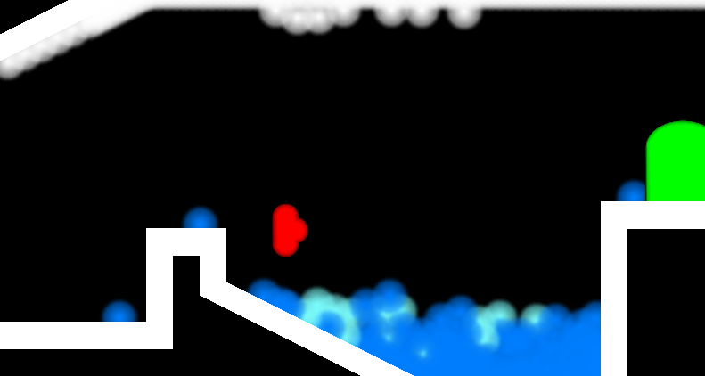

In December of 2012, I decided to participate in the [Experimental Gameplay Project](http://experimentalgameplay.com/). It's a game development jam where, given a theme, it's our objective to create a game around that theme in less than a week. You must work alone, and you can't spend more than 1 week on the project. The November/December theme was **temperature**. I decided to try to make a 2D side-scrolling puzzle-platformer based around changing water particles into steam, ice, and back into water again. It was written entirely in [Unity 3D](http://unity3d.com/) with Javascript.

I learned a ton while doing this, notably what it feels to actually get near to completing a game. I learned about basic platforming physics (how to tell if a character is on an uneven but jumpable surface, removing wall friction, player-adjustable jump height), but I also learned a lot about some advanced physical modeling concepts; notably [Smoothed Particle Hydrodynamics](http://en.wikipedia.org/wiki/Smoothed-particle_hydrodynamics) and [Metaballs](http://en.wikipedia.org/wiki/Metaballs). Smoothed Particle Hydrodynamics is a non-mapped modeling and simulation based entirely on individual particle calculation, and is aimed at producing very fast framerates. [This presentation](http://www.gdcvault.com/play/1012447/Go-With-the-Flow-Fluid), by the developers of [PixelJunk Shooter](http://pixeljunk.jp/library/Shooter/), was extremely helpful in understanding the calculations at work. Metaballs, on the other hand, are aimed specifically at rendering large quantities of particles without having it look like a dust cloud. By converting the particle locations into a texture and applying a gaussian shading to each particle, you can take the threshold and come out with some very "blobby" looking particles. [This article](http://nullcandy.com/2d-metaballs-in-xna/) was very helpful in helping me understand what was going on. While I was unable to implement metaballs in time for the week deadline, it's definitely something I want to continue to work with.

[Play it here.](play)
